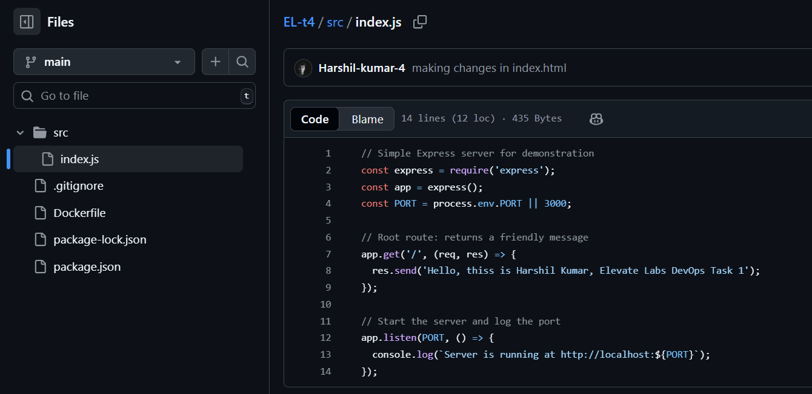

# DevOps Project: Version Control with Git and GitHub

## Overview

This project demonstrates how to manage a DevOps-based Node.js application using Git and GitHub, following widely accepted best practices. The focus is on organizing workflow with branching strategies, commit discipline, pull requests, tagging, and maintaining proper documentation throughout the project lifecycle.

---

## 1. Initializing the Git Repository

Start by setting up Git for your project. If your repository is not yet initialized, run the following commands in the root directory of your project:

```bash
git init
git remote add origin https://github.com/Harshil-k4/EL-t4.git
git branch -M main
git push -u origin main
```
This creates a local Git repository, links it to a remote GitHub repository, sets the main branch, and pushes the code.

Output:


2. Setting Up the .gitignore File
To keep your repository clean and avoid committing sensitive or unnecessary files, create a .gitignore file in your project root. Here’s an example suited for a Node.js project with DevOps tools:

```bash

# Node.js
node_modules/
npm-debug.log

# Logs
*.log

# Environment variables
.env

# IDE settings
.idea/
.vscode/

# Terraform
*.tfstate
.terraform/
```
Output:


here we can see that node_modules has not been pushed despite been in the folder.

3. Branching Strategy
To maintain code quality and allow for collaborative development, follow a simple yet effective branching strategy:

main: Contains stable, production-ready code.

dev: Serves as the integration branch for ongoing development.

feature/<feature-name>: Dedicated branches for new features or improvements.

Creating Branches
```bash
git checkout -b dev main
git push -u origin dev

git checkout -b feature/readme-structure dev
git push -u origin feature/readme-structure
```

Output:


4. Writing Effective Commits
Make small, frequent commits with clear and descriptive messages to help track the history of changes.

Example Workflow
```bash

git add .
git commit -m "example commit"
git push
```
Commit Message Guidelines

Use present tense ("Add feature", not "Added feature").

Be specific but concise.

Reference related issue/ticket if applicable.

Output:


## 5. Creating and Managing Pull Requests (PRs)

Pull Requests (PRs) are used to review code changes before integrating them into the main development branches. This ensures code quality, collaboration, and traceability.

---

### A. Feature Branch Workflow

Follow these steps to create a PR from a feature branch into the `dev` branch.

#### Step-by-Step Commands

```bash
# Step 1: Switch to dev and create a new feature branch
git checkout dev
git pull origin dev
git checkout -b feature/add-samplefeat

# Step 2: Make your changes (e.g., edit index.js or Dockerfile)

# Step 3: Stage and commit your changes
git add .
git commit -m "Add login functionality"

# Step 4: Push the feature branch to GitHub
git push -u origin feature/add-samplefeat
```
Step 5: Open Pull Request on GitHub

Go to your GitHub repository.

You’ll see a prompt to "Compare & Pull Request" for the new branch.

Select base branch as dev, and compare branch as feature/add-samplefeat.

Add a clear PR title and description.

Submit the PR.

After review and approval, click Merge Pull Request.

Output:


Merging Dev to Main via PR
Once all relevant features have been merged into the dev branch, and it's tested, follow this process to merge it into main.

Step-by-Step Commands
```bash
# Step 1: Switch to main and pull latest changes
git checkout main
git pull origin main

# Step 2: Pull latest dev changes into main (optional if using GitHub PR)
git merge origin/dev

# Step 3: Push main branch updates to GitHub
git push origin main
```

Step 4: Open Pull Request on GitHub
Go to your repository


Click "Compare & Pull Request"

Set base branch to main and compare branch to dev

Add a versioned title like Release v1.0.0

After review, click Merge Pull Request

Output:


changes has reflected on main branch

6. Merging
Merging integrates changes from one branch into another, preserving the commit history.

```bash
git checkout dev
git merge feature/add-samplefeat
```
Use this for preserving full history

Good for feature-to-dev merges

Output:


7. Rebasing
Rebasing rewrites history by placing your changes on top of another base tip.

Example
```bash
git checkout feature/add-samplefeat
git rebase dev
```
Use when:

You want a linear, clean history

You're the only one working on the branch

Note: Avoid rebasing shared branches unless everyone agrees.

Output:


8. Tagging Releases
Tag stable commits on the main branch for versioning:

```bash
git checkout main
git pull origin main
git tag -a v1.0.0 -m "Release version 1.0.0"
git push origin v1.0.0
```
Follow semantic versioning: v<major>.<minor>.<patch>

Output:


Summary
This project showcases:

A robust Git branching model

Clean commit discipline

Collaborative pull request flow

Proper release tagging

Markdown-based documentation

Clear handling of merging and rebasing